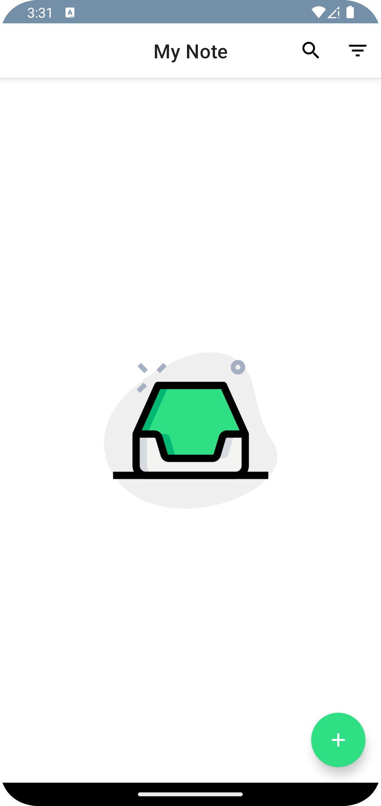
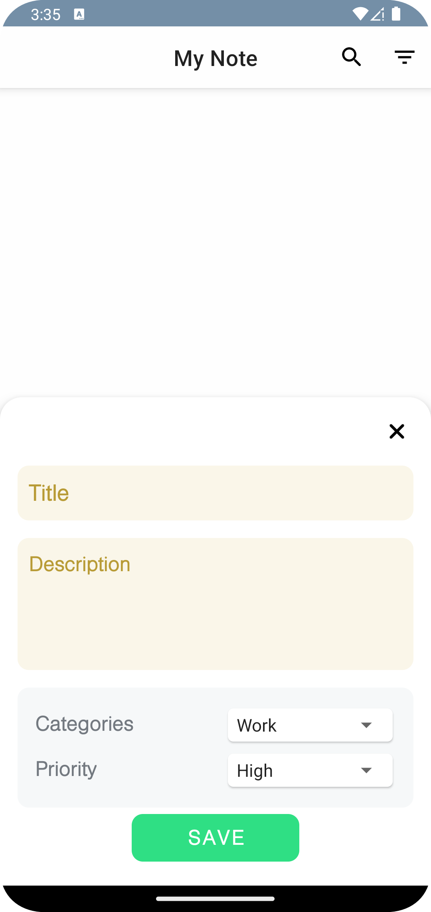
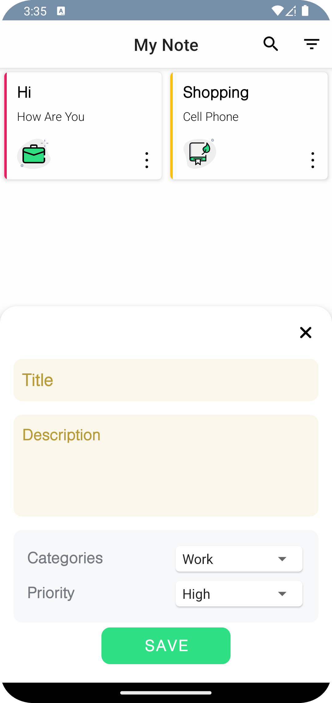

# ToDolist App With Kotlin
A simple ToDo Task Manager App made in Kotlin using xml and RoomDb and MVVM and Hilt

The technologies used in this project consist of:

* RoomDatabase
* ViewBinding
* DiffUtils
* RxJava
* Hilt
* MVP

## Screenshots

    
